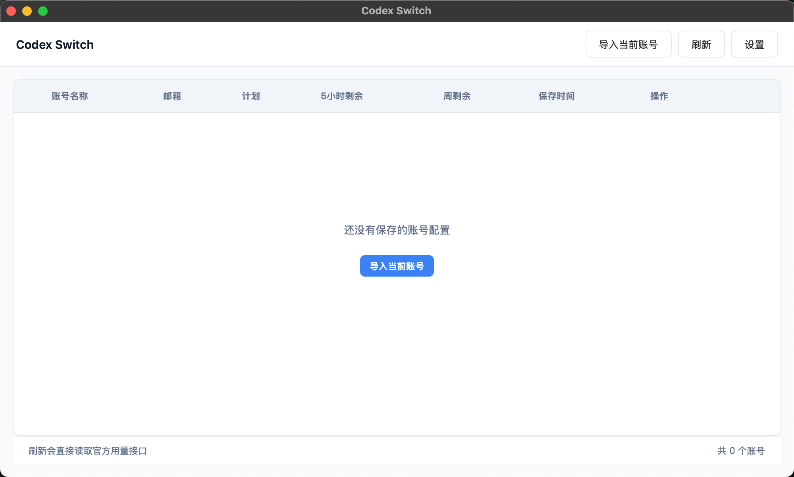

# Codex Switch

[English README](README.md)


`Codex Switch` 是一个用于备份、切换和查看多个 Codex 账号配置的桌面与脚本工具。

## 演示截图



## 项目概览

- 提供适合日常切换账号的 Tauri 桌面应用。
- 提供用于备份、恢复和查看用量的 Python 脚本。
- 支持本地账号存储和用量缓存。
- 支持 macOS、Windows 和 Linux。

## 上游说明

本仓库基于 [Skywang16/codex-account-manager](https://github.com/Skywang16/codex-account-manager) 修改而来。

## 许可证说明

上游项目使用 MIT License。MIT 属于宽松许可证，你可以修改并发布到自己的 GitHub 仓库。

核心要求是：发布时保留许可证全文和版权声明，不要删除上游作者的许可信息。

## 快速开始

### 桌面版

```bash
cd codex-tauri-app
npm install
npm run tauri dev
```

构建发布包：

```bash
cd codex-tauri-app
npm run tauri build
```

### 脚本版

```bash
python3 backup_current_account.py
python3 switch_account.py
python3 check_usage.py
python3 codex_account_manager.py
```

## 主要功能

- 备份当前账号配置
- 快速切换已保存账号
- 查看缓存用量并刷新当前账号用量
- 同时支持 Tauri 桌面应用和 Python 脚本

## 项目结构

```text
codex-switch/
├── README.md
├── README.zh-CN.md
├── LICENSE
├── backup_current_account.py
├── check_usage.py
├── codex_account_manager.py
├── codex_account_manager_web.py
├── switch_account.py
├── usage_checker.py
├── assets/
└── codex-tauri-app/
```

## 发布建议

- 发布到你自己的 GitHub 时，保留 `LICENSE` 文件。
- README 中继续保留对上游仓库的说明更稳妥。
- 安装包建议通过 GitHub Releases 分发，不要直接提交到仓库。
